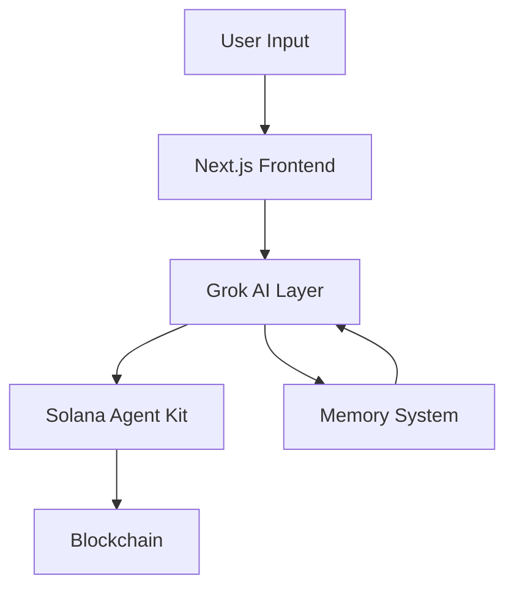

# Solana-Agent-Kit-4.20

# Building AI-Powered Solana Applications with Grok and Agent Kit

## Table of Contents

1. [Introduction](#introduction)
2. [Technical Innovation](#technical-innovation)
3. [Architecture Overview](#architecture-overview)
4. [Key Components](#key-components)
5. [Implementation Guide](#implementation-guide)
6. [Advanced Features](#advanced-features)
7. [Best Practices](#best-practices)
8. [Future Directions](#future-directions)

## Introduction

This guide documents our groundbreaking integration of xAI's Grok model with the Solana Agent Kit, creating a powerful new paradigm for blockchain interaction. By combining Grok's advanced language understanding capabilities with Solana's high-performance blockchain, we've created an AI-first approach to Web3 development.

### Why This Matters

Traditional blockchain interactions require deep technical knowledge and understanding of complex APIs. Our integration democratizes access to Solana's ecosystem by enabling natural language interactions with blockchain functionality.

## Technical Innovation

### Novel Aspects

1. **AI-First Architecture**: Unlike traditional Web3 applications that bolt on AI as an afterthought, our solution puts AI at the core of the architecture.

2. **Multimodal Interactions**: By leveraging Grok's vision capabilities, users can interact with the blockchain through text AND images.

3. **Context-Aware Operations**: The system maintains conversation context and understands complex, multi-step blockchain operations.

## Architecture Overview

### System Components



### Key Technologies

- **Frontend**: Next.js 14 with App Router
- **AI Model**: Grok-1 and Grok-1-vision
- **Blockchain**: Solana
- **Agent Framework**: LangChain.js
- **Development Tools**: TypeScript, Tailwind CSS

## Key Components

### 1. Grok Integration Layer

```typescript
const llm = new ChatOpenAI({
  temperature: 0.7,
  modelName: "grok-1",
  apiKey: process.env.XAI_API_KEY,
});
```

The Grok integration layer provides:
- Natural language understanding
- Context maintenance
- Multi-turn conversations
- Image analysis capabilities

### 2. Token Management System

Our TokenLauncher component provides a user-friendly interface for token creation with:
- Automated validation
- Accessibility features
- Real-time feedback
- Secure transaction handling

### 3. NFT Operations

The system supports advanced NFT operations:
- Collection creation
- Metadata management
- Bulk minting
- Royalty configuration

## Implementation Guide

### Prerequisites

1. Environment Setup
```bash
pnpm install
cp .env.example .env.local
```

2. Configuration
```env
XAI_API_KEY=your_xai_api_key_here
RPC_URL=your_rpc_url_here
SOLANA_PRIVATE_KEY=your_base58_private_key_here
```

### Core Features

1. **Token Launch**
   - Natural language command: "Launch a token with 9 decimals"
   - Form-based interface with accessibility support
   - Automated contract deployment

2. **NFT Management**
   - Collection creation through chat
   - Bulk operations support
   - Metadata management

3. **Market Analysis**
   - Price tracking
   - Trading opportunities
   - Liquidity analysis

## Advanced Features

### 1. Vision Model Integration

```typescript
const visionLLM = new ChatOpenAI({
  temperature: 0.7,
  modelName: "grok-1-vision",
  apiKey: process.env.XAI_API_KEY,
});
```

Use cases:
- NFT artwork analysis
- QR code processing
- Chart interpretation

### 2. Memory System

The system maintains context across sessions using:
- Short-term conversation memory
- Long-term knowledge base
- Cross-session state management

## Best Practices

1. **Security**
   - Never expose private keys
   - Use environment variables
   - Implement rate limiting
   - Add transaction confirmation steps

2. **Performance**
   - Implement caching strategies
   - Use WebSocket for real-time updates
   - Optimize batch operations

3. **User Experience**
   - Provide clear feedback
   - Implement progressive loading
   - Add error recovery mechanisms

## Future Directions

1. **Enhanced AI Capabilities**
   - Multi-chain support
   - Advanced trading strategies
   - Automated portfolio management

2. **Technical Improvements**
   - Zero-knowledge proofs integration
   - Layer 2 scaling solutions
   - Cross-chain operations

3. **User Experience**
   - Mobile-first interface
   - Voice commands
   - AR/VR integration

## Conclusion

Our integration of Grok with Solana Agent Kit represents a significant step forward in making blockchain technology more accessible and user-friendly. By combining AI's natural language understanding with blockchain's trustless operations, we've created a platform that opens new possibilities for both developers and users.

The innovation lies not just in the technical integration, but in the paradigm shift it enables: from complex technical interactions to natural, conversational blockchain operations. This approach significantly lowers the barrier to entry for blockchain development while maintaining the power and flexibility that makes Solana a leading blockchain platform.
